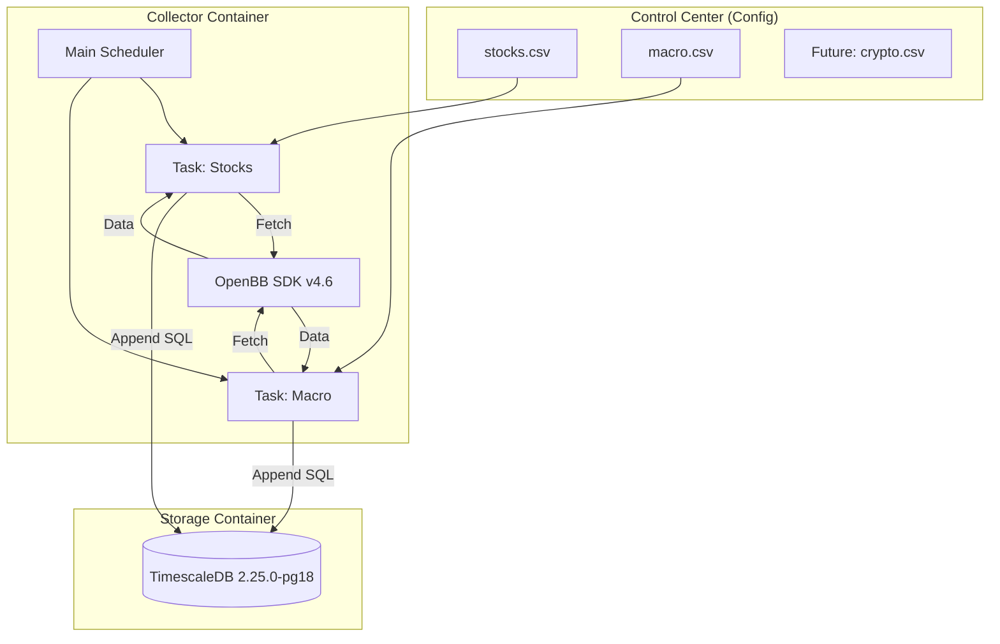

# Quant Headless Collector System Specification

**版本**: 1.3.0 (Modular Expansion Edition)
**日期**: 2026-02-04
**核心定位**: 基于 OpenBB v4.6 的模块化、配置驱动型金融数据采集引擎。

## 1. 项目概述 (Project Overview)

本项目构建一个单节点、无头模式（Headless）的数据采集系统。它通过 OpenBB 统一接口获取多资产类别（股票、宏观，未来包含加密货币等）数据，并持久化至 TimescaleDB。

**核心设计理念**：

1. **配置驱动 (Config-Driven)**: 采集什么股票、什么指标，由外部 CSV 文件控制，无需修改代码。
2. **模块化 (Modular)**: 股票、宏观、加密货币各自独立为 Task 模块，互不干扰。
3. **技术锁定 (Version Locked)**: 锁定 OpenBB v4.6.0 与 TimescaleDB (PG18)，确保十年稳定。

## 2. 系统架构 (Architecture)



## 3. 目录结构 (Directory Structure)

```text
quant_headless/
├── docker-compose.yml       # [基础设施] 服务编排
├── Dockerfile               # [运行环境] OpenBB 统一镜像
├── config/                  # [控制中心] 外部配置文件 (挂载)
│   ├── stock_tickers.csv    # 股票代码列表 (如 AAPL, MSFT)
│   └── macro_series.csv     # (可选) 宏观指标列表
└── scripts/                 # [业务逻辑]
    ├── main.py              # 调度总管
    ├── database.py          # 数据库底层工具
    └── tasks/               # [插件系统]
        ├── __init__.py
        ├── stocks.py        # 股票采集模块
        └── macro.py         # 宏观采集模块

```

---

## 4. 容器配置规范

### 4.1 采集器 (Collector)

* **基础镜像**: `python:3.11-slim-bookworm`
* **核心库**: `openbb==4.6.0` (含 yfinance, fred, pandas 等全套依赖)
* **关键配置**:
```dockerfile
# Dockerfile 核心片段
ARG OPENBB_VERSION=4.6.0
RUN pip install openbb==${OPENBB_VERSION} psycopg2-binary sqlalchemy schedule
# 创建配置目录挂载点
RUN mkdir -p /app/config

```


### 4.2 数据库 (TimescaleDB)

* **镜像**: `timescale/timescaledb:2.25.0-pg18` (基于 PostgreSQL 18)
* **资源限制**: `shm_size: 1g` (单机性能保障)
* **网络**: 暴露 `5432` 端口供外部消费。

### 4.3 Docker Compose 配置

```yaml
version: '3.8'
services:
  collector:
    build: .
    restart: unless-stopped
    depends_on:
      timescaledb:
        condition: service_healthy
    volumes:
      - ./scripts:/app/scripts
      - ./config:/app/config  <-- 关键挂载：配置热更新
    environment:
      - DB_HOST=timescaledb
      - DB_NAME=quant_data
      - DB_USER=postgres
      - DB_PASS=quant_password

  timescaledb:
    image: timescale/timescaledb:2.25.0-pg18
    shm_size: 1g
    restart: unless-stopped
    environment:
      - POSTGRES_PASSWORD=quant_password
    ports:
      - "5432:5432"
    healthcheck:
      test: ["CMD-SHELL", "pg_isready -U postgres"]
      interval: 10s
      retries: 5

```

---

## 5. 核心逻辑与扩展机制

### 5.1 通用数据库工具 (`database.py`)

负责初始化 DB 连接池，并自动将所有新创建的表转换为 Hypertable。

### 5.2 任务模块化实现

#### 模块 A: 股票采集 (`tasks/stocks.py`)

1. **读取配置**: 每次运行时读取 `/app/config/stock_tickers.csv`。
2. **获取数据**: 调用 `obb.equity.price.historical(symbol="AAPL,MSFT...", provider="yfinance")`。
3. **入库**: 存入表 `market_stocks_daily`。

#### 模块 B: 宏观采集 (`tasks/macro.py`)

1. **读取配置**: (可选) 读取配置或硬编码关键指标。
2. **获取数据**: 调用 `obb.economy.cpi(provider="fred")` 等接口。
3. **入库**: 存入表 `macro_economic_data`。

### 5.3 调度总管 (`main.py`)

负责编排所有模块的运行时间。

```python
# 伪代码逻辑
def run_scheduler():
    init_db()
    # 每天 06:00 跑股票
    schedule.every().day.at("06:00").do(run_stock_task)
    # 每天 08:00 跑宏观
    schedule.every().day.at("08:00").do(run_macro_task)
    
    while True:
        schedule.run_pending()

```

---

## 6. 使用与扩展指南 (Operation Guide)

### 6.1 初始化与启动

1. 创建 `config/stock_tickers.csv`，填入你想抓取的代码（如 `NVDA`）。
2. 运行命令：
```bash
docker-compose up -d --build

```


### 6.2 如何调整抓取列表？

* **操作**: 直接在本地编辑 `config/stock_tickers.csv`。
* **生效**: 下次定时任务触发时（或重启容器后）自动生效。无需重新构建镜像。

### 6.3 未来如何增加"加密货币"？

1. **配置**: 新建 `config/crypto.csv` (填入 `BTC-USD`)。
2. **代码**: 复制 `tasks/stocks.py` 为 `tasks/crypto.py`，将 OpenBB 调用改为 `obb.crypto.price.historical`。
3. **注册**: 在 `main.py` 中导入并添加 `schedule` 规则。

---

## 7. 数据存储规范 (Schema)

所有数据表均由 TimescaleDB 管理，自动按时间分区。

| 表名 | 描述 | 关键字段 | 更新频率 |
| --- | --- | --- | --- |
| `market_stocks_daily` | 全球股票日线 | `date`, `symbol`, `close`, `volume` | 每日 |
| `macro_economic_data` | 宏观经济指标 | `date`, `value` (宽表结构) | 每日/每月 |
| *(未来)* `market_crypto_daily` | 加密货币日线 | `date`, `symbol`, `close` | 每小时 |

---

## 8. 交付物清单

* [x] `docker-compose.yml` (配置完成)
* [x] `Dockerfile` (锁定完成)
* [x] `scripts/` 源码包 (模块化结构)
* [x] `config/` 示例文件
