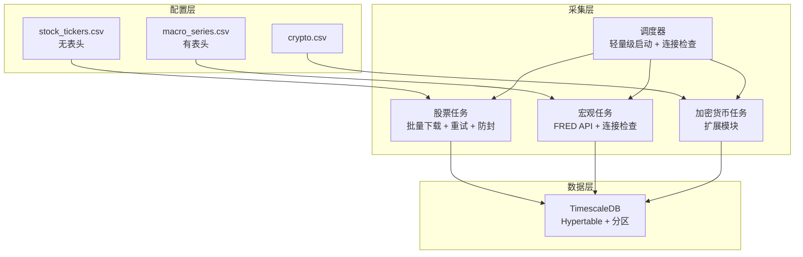

# Quant Headless Collector System Specification

**版本**: 2.0.0 (Anti-Ban Optimization Edition)
**日期**: 2025-02-05
**核心定位**: 基于 yfinance 的防封禁、模块化、配置驱动型金融数据采集引擎。

## 1. 项目概述

### 1.1 系统定位
本项目构建一个单节点、无头模式（Headless）的数据采集系统。它通过 yfinance 和 FRED API 获取多资产类别（股票、宏观，未来包含加密货币等）数据，并持久化至 TimescaleDB。

### 1.2 核心设计理念

1. **配置驱动 (Config-Driven)**: 采集什么股票、什么指标，由外部 CSV 文件控制，无需修改代码。
2. **模块化 (Modular)**: 股票、宏观、加密货币各自独立为 Task 模块，互不干扰。
3. **防封禁优先 (Anti-Ban First)**: 采用批量下载、单线程模式、长间隔休眠等策略，极大降低 IP 封禁风险。
4. **技术锁定 (Version Locked)**: 锁定 Python 3.11 与 TimescaleDB (PG18)，确保十年稳定。

### 1.3 功能概述
- 股票数据采集：通过 yfinance 批量下载美股、港股等日线数据
- 宏观数据采集：通过 FRED API 获取宏观经济指标
- 数据持久化：存储至 TimescaleDB，自动分区
- 定时调度：支持每日定时采集

## 2. 系统架构

### 2.1 架构图


### 2.2 架构说明
- **配置层**: 外部 CSV 配置文件，控制采集内容
- **采集层**: 模块化任务，独立采集不同数据源
- **数据层**: TimescaleDB 持久化存储，自动分区

## 3. 项目架构

### 3.1 目录结构

```text
/workspace/code/openbb-extend/
├── docker-compose.yml          # Docker 编排文件
├── Dockerfile                  # 容器镜像定义
├── requirements.txt            # Python 依赖
├── config/                     # 配置文件目录（挂载卷）
│   ├── stock_tickers.csv       # 股票代码列表
│   └── macro_series.csv        # 宏观指标 Series ID 列表
├── db_data/                    # 数据库数据持久化（挂载卷，gitignore）
├── docs/                       # 文档目录
│   ├── SPEC.md                 # 系统规格说明书
│   └── DEPLOYMENT.md           # 部署指南
├── scripts/                    # 业务逻辑目录
│   ├── __init__.py
│   ├── collector.py            # 【采集】调度器入口
│   ├── database.py             # 【共享】数据库连接池与工具
│   ├── tasks/                  # 【采集】采集任务模块
│   │   ├── __init__.py
│   │   ├── stocks.py           # 【采集】股票数据采集任务
│   │   └── macro.py            # 【采集】宏观数据采集任务
│   └── api/                    # 【API】数据查询 API 模块
│       ├── __init__.py
│       ├── main.py             # 【API】FastAPI 入口
│       └── routers/
│           ├── __init__.py
│           ├── macro.py        # 【API】宏观数据查询接口
│           └── stocks.py       # 【API】股票数据查询接口
└── README.md                   # 项目说明
```

### 3.2 模块职责

| 模块 | 职责 | 关键函数/类 |
|------|------|------------|
| `main.py` | 【统一】服务入口，启动采集+API | `main()` |
| `database.py` | 数据库连接管理与 Hypertable 工具 | `get_engine()`, `ensure_hypertable()` |
| `tasks/stocks.py` | 股票数据采集 | `fetch_stock_data()` |
| `tasks/macro.py` | 宏观数据采集 | `fetch_macro_data()`, `init_macro_table()` |
| `api/main.py` | 【API】数据查询服务入口 | FastAPI App |
| `api/routers/` | 数据查询接口 | `macro.py`, `stocks.py` |

## 4. 核心功能需求

### 4.1 数据库工具功能需求

#### 4.1.1 连接池管理
- 使用 SQLAlchemy 创建数据库连接池
- 启用 `pool_pre_ping=True` 防止连接断开
- 从环境变量读取连接信息

#### 4.1.2 初始化功能 (`init_db_environment()`)
- 创建 TimescaleDB 扩展 (如果不存在)
- 确保数据库环境就绪
- 初始化失败则退出程序

#### 4.1.3 超表转换功能 (`ensure_hypertable(table_name, time_col)`)
- 将普通表转换为 Hypertable
- 参数:
  - `table_name`: 表名
  - `time_col`: 时间列名 (默认 'date')
- 功能:
  - 如果表已是 Hypertable，不做处理
  - 如果表已有数据，自动迁移数据到分区
  - 失败时仅警告，不中断程序

### 4.2 股票采集功能需求

#### 4.2.1 配置文件格式
- 路径: `/app/config/stock_tickers.csv`
- 格式: 无表头，每行一个股票代码
- 示例:
  ```
  AAPL
  MSFT
  GOOGL
  ```

#### 4.2.2 启动连通性检查 (`check_yfinance_status()`)
- 功能: 下载 SPY 1 天数据，验证连接状态
- 返回: True (成功) / False (失败)
- 超时: 3 秒
- 错误处理: 捕获异常并记录日志

#### 4.2.3 批量下载功能 (`fetch_stock_data()`)
- 读取配置文件，获取股票列表
- 去重、排序、清洗
- 分批处理 (每批 20 只)
- 调用 `process_batch()` 处理每批数据

#### 4.2.4 批次处理功能 (`process_batch(chunk_tickers, engine, table_name)`)
- 输入:
  - `chunk_tickers`: 股票代码列表 (长度 <= 20)
  - `engine`: 数据库引擎
  - `table_name`: 表名

- 下载逻辑:
  - 使用 yfinance 下载数据
  - 参数:
    - `period="1d"`: 1 天数据
    - `group_by='ticker'`: 按股票分组
    - `auto_adjust=True`: 自动调整价格
    - `progress=False`: 不显示进度条
    - `threads=False`: 单线程模式

- 重试机制:
  - 重试次数: 3 次
  - 重试延迟: 5秒 → 10秒 → 15秒 (递增)
  - 错误识别: 自动识别 429 限流错误
  - 错误详情: 记录 `yf.shared._ERRORS` 详细信息

- 批次间隔: 随机休眠 10-20 秒 (最后一批除外)

#### 4.2.5 数据清洗与入库
- 支持 MultiIndex (多只股票) 和 SingleIndex (单只股票) 格式
- 标准化列名 (小写、下划线)
- 添加 `symbol` 列
- 重命名 `Date` 为 `date`
- 去除空值
- 批量入库 (使用 `to_sql`)

### 4.3 宏观采集功能需求

#### 4.3.1 API 连通性检查 (`test_fred_connectivity(api_key)`)
- 功能: 下载 GDP 1 条数据，验证 API Key 有效性
- 返回: True (成功) / False (失败)
- 超时: 5 秒
- 错误处理:
  - 400: API Key 无效
  - 403: 权限被拒绝
  - 其他: 记录详细错误

#### 4.3.2 配置
- 环境变量: `FRED_API_KEY` (必填)
- 配置文件: `/app/config/macro_series.csv` (可选，有表头)
- 硬编码任务列表 (备选):
  - CPI (CPIAUCSL): 消费者物价指数
  - GDP (GDP): 国内生产总值
  - UNRATE (UNRATE): 失业率
  - FEDFUNDS (FEDFUNDS): 联邦基金利率
  - M2 (M2SL): 货币供应量 M2

#### 4.3.3 数据采集功能 (`fetch_macro_data()`)
- 调用 `test_fred_connectivity()` 检查连接
- 如果检查失败，终止任务
- 注入 OpenBB API Key
- 遍历任务列表，采集每个指标
- 使用 `obb.economy.fred_series()` 获取数据
- 参数:
  - `symbol`: 指标 ID
  - `provider="fred"`
  - `start_date="1950-01-01"` (获取历史数据)

#### 4.3.4 数据清洗与入库
- 标准化列名 (将数值列重命名为 `value`)
- 添加 `series_id` 列
- 去除空值
- 转换日期格式
- 批量入库 (使用 `to_sql`)

### 4.4 调度器功能需求

#### 4.4.1 启动流程
- 记录启动信息 (OpenBB 版本、时间戳)
- 初始化数据库环境 (`init_db_environment()`)
- 注册定时任务:
  - 股票采集: 每天 06:00 (`fetch_stock_data`)
  - 宏观采集: 每天 08:00 (`fetch_macro_data`)
- 打印任务计划表 (便于确认时区)
- 执行启动前网络连通性检查:
  - 调用 `check_yfinance_status()`
  - 成功: 记录日志"系统就绪"
  - 失败: 记录错误日志，但继续运行
- 进入守护模式

#### 4.4.2 守护模式
- 每分钟检查一次待执行任务
- 捕获 `KeyboardInterrupt` 异常，优雅退出
- 捕获其他异常，记录详细堆栈 (`exc_info=True`)，休眠 60 秒后继续

#### 4.4.3 日志配置
- 级别: INFO
- 格式: `时间 [级别] 模块: 消息`
- 输出: 标准输出 (stdout)

## 5. 接口规范

### 5.1 数据库工具接口

```python
def get_engine():
    """返回数据库引擎实例"""
    pass

def init_db_environment():
    """初始化数据库环境，确保 TimescaleDB 扩展已启用"""
    pass

def ensure_hypertable(table_name: str, time_col: str = 'date'):
    """将表转换为 Hypertable，支持数据迁移"""
    pass
```

### 5.2 股票采集接口

```python
def check_yfinance_status() -> bool:
    """检查 Yahoo Finance 连接状态"""
    pass

def process_batch(chunk_tickers: List[str], engine, table_name: str):
    """处理一个批次的股票数据"""
    pass

def fetch_stock_data():
    """股票数据采集主入口"""
    pass
```

### 5.3 宏观采集接口

```python
def test_fred_connectivity(api_key: str) -> bool:
    """检查 FRED API 连接状态"""
    pass

def fetch_macro_data():
    """宏观数据采集主入口"""
    pass
```

### 5.4 调度器接口

```python
def run_scheduler():
    """调度器主入口"""
    pass

if __name__ == "__main__":
    run_scheduler()
```

### 5.5 数据查询 API 接口

**启动方式**:
```bash
uvicorn scripts.api.main:app --host 0.0.0.0 --port 8000
```

**接口列表**:

| 方法 | 路径 | 说明 |
|------|------|------|
| GET | `/` | 服务信息 |
| GET | `/api/v1/health` | 健康检查 |
| GET | `/api/v1/macro/indicators` | 获取宏观指标列表 |
| GET | `/api/v1/macro/data` | 查询宏观指标历史数据 |
| GET | `/api/v1/macro/data/latest` | 获取宏观指标最新数据 |
| GET | `/api/v1/stocks/symbols` | 获取股票代码列表 |
| GET | `/api/v1/stocks/data` | 查询股票历史数据 |
| GET | `/api/v1/stocks/data/latest` | 获取股票最新数据 |

**通用参数**:
- `start_date`: 开始日期 (YYYY-MM-DD)
- `end_date`: 结束日期 (YYYY-MM-DD)
- `limit`: 返回条数限制 (默认 1000, 最大 10000)

**文档地址**: `http://localhost:8000/docs`

## 6. 数据结构规范

### 6.1 Hypertable 要求

所有数据表必须转换为 Hypertable:

1. **自动分区**:
   - 按时间列自动分区
   - 时间列名称: `date`
   - 支持已有数据迁移到分区

2. **转换规则**:
   - 首次写入时自动转换
   - 支持重复调用 (幂等性)
   - 失败时仅警告，不中断程序

### 6.2 股票日线数据表 (`market_stocks_daily`)

| 字段 | 类型 | 说明 | 约束 |
|------|------|------|------|
| `date` | DATE | 日期 | 主键部分 |
| `symbol` | VARCHAR(20) | 股票代码 | 主键部分 |
| `open` | NUMERIC | 开盘价 | 非空 |
| `high` | NUMERIC | 最高价 | 非空 |
| `low` | NUMERIC | 最低价 | 非空 |
| `close` | NUMERIC | 收盘价 | 非空 |
| `volume` | BIGINT | 成交量 | 非空 |

**Hypertable 配置**:
- 时间列: `date`
- 分区间隔: 自动 (TimescaleDB 默认)
- 更新频率: 每日 06:00

### 6.3 宏观经济数据表 (`macro_economic_data`)

| 字段 | 类型 | 说明 | 约束 |
|------|------|------|------|
| `date` | DATE | 日期 | 主键部分 |
| `series_id` | VARCHAR(20) | 指标 ID (如 WALCL) | 主键部分 |
| `indicator_name` | VARCHAR(100) | 指标中文名称 | - |
| `value` | NUMERIC | 指标值 | 非空 |
| `frequency` | VARCHAR(50) | 数据频率 | - |
| `provider` | VARCHAR(20) | 数据来源 | 默认 'fred' |
| `created_at` | TIMESTAMP | 入库时间 | 默认 CURRENT_TIMESTAMP |

**索引**:
- `idx_macro_economic_data_series_id` ON `series_id`

**Hypertable 配置**:
- 时间列: `date`
- 分区间隔: 自动 (TimescaleDB 默认)
- 更新频率: 每日 08:00

**去重策略**:
- 入库前先删除该指标在日期范围内的旧数据，再插入新数据

### 6.4 加密货币日线数据表 (`market_crypto_daily`) (未来)

| 字段 | 类型 | 说明 | 约束 |
|------|------|------|------|
| `date` | TIMESTAMP | 时间戳 | 主键部分 |
| `symbol` | VARCHAR(50) | 代币代码 | 主键部分 |
| `close` | NUMERIC | 收盘价 | 非空 |

**Hypertable 配置**:
- 时间列: `date`
- 分区间隔: 自动 (TimescaleDB 默认)
- 更新频率: 每小时
